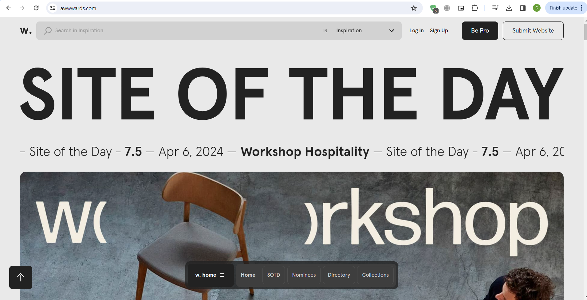
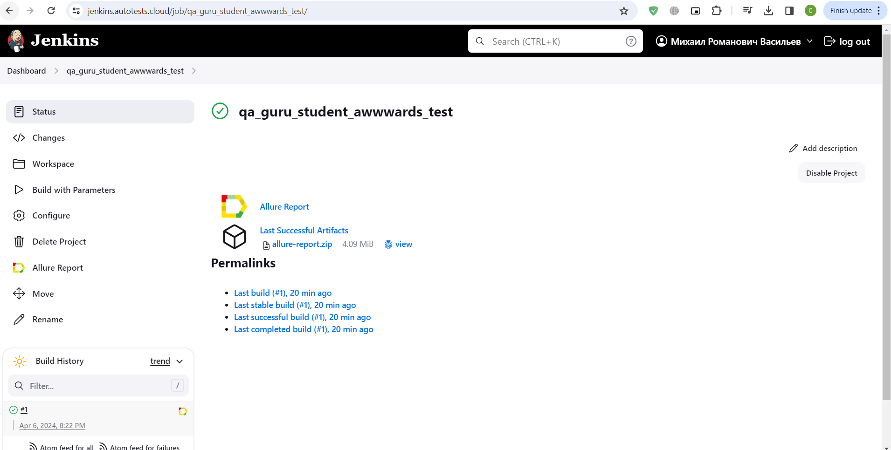
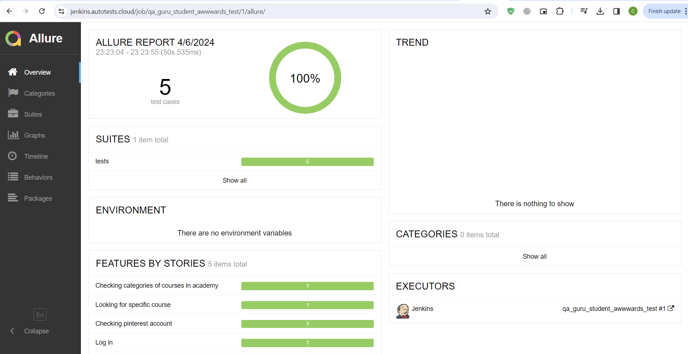
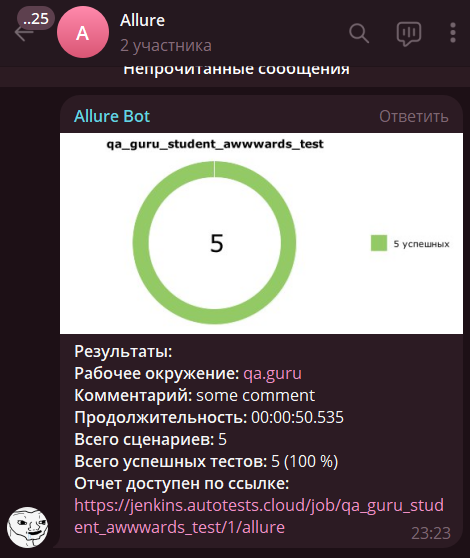

# Тестирование сайта <a target="_blank" href="https://www.awwwards.com/">Awwwards.com</a>

---
### Проверки, реализованные в автотестах
1. Вход существующего пользователя.
2. Отображение страны пользователя в его профиле.
3. Сверка доступных категорий курсов.
4. Поиск курса.
5. Ссылка на аккаунт Pinterest.

---

### Используемые инструменты
        

---

### Запуск автотестов осуществляется с помощью Jenkins
> [Ссылка на сборку в Jenkins](https://jenkins.autotests.cloud/job/qa_guru_student_awwwards_test/)

#### Для запуска автотестов в Jenkins
1. Открыть [задачу в Jenkins](https://jenkins.autotests.cloud/job/qa_guru_student_awwwards_test/)

2. Нажать "**Build Now**".

---

### Allure отчет

---

### Уведомления в Телеграм

---

### Прохождение автотеста

